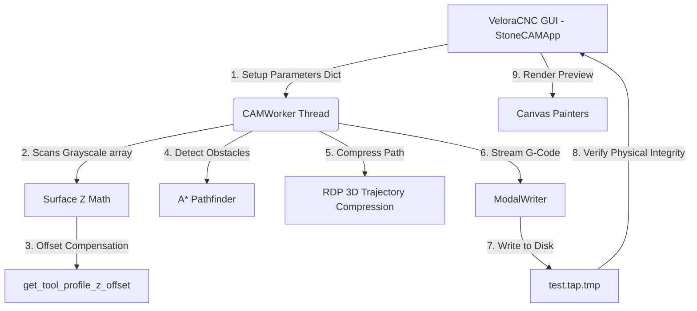

# Velora CNC - Developer Handover & Architecture Specification Manual
**System Blueprint & Codebase Documentation**
*Author: Antigravity Code Assistant*
*Project Owner: Eng. Bara Eiz (almaamoneiz@gmail.com)*

---

This document serves as a comprehensive developer handover manual for **Velora CNC** (formerly Stone Carver CAM), detailing the architectural design, mathematical models, data structures, variables, and code logic. This ensures a seamless transition to another engineering team or another instance of the Antigravity AI agent.

---

## 📂 Codebase & File Manifest

The Velora CNC repository consists of the following key files:
1. **`stone_cam_app.py`**: The core source code containing the PySide6 UI definitions, math logic, background thread worker, modal G-code writers, and obstacle avoidance paths.
2. **`tools_library.json`**: Persistent JSON database storing custom tools (Flat, Ball Nose, V-Bit, Tapered Ball Nose).
3. **`generate_gcode.py`**: Original command-line or utility script for G-code parsing.
4. **`test_gcode_pipeline.py`**: Automated integration test verifying collinear compression, modal suppression, and No-Go zone crossover avoidance.
5. **`test_nogo.py`**: Pathfinder verification test script.
6. **`test_tool_geometry.py`**: Math verify script for tapered conical and spherical Z-profile offsets.
7. **`README.md`**: User-facing application manual.
8. **`requirements.txt`**: Declares package versions for portability.

---

## 🛠️ Python Libraries & Environment Setup

To run Velora CNC from source on any machine, the following scientific libraries are required:
```text
PySide6>=6.4.0
numpy>=1.22.0
Pillow>=9.0.0
pyinstaller>=6.0.0
```

---

## 🧠 Class Architecture & Data Flow



---

## 1. Class: `CAMWorker(QThread)`
The heavy multi-pass G-code compilation is offloaded to a background thread to prevent UI freezing.

### 📥 Input Parameters (`self.params`)
The worker accepts a single dictionary payload populated from the GUI elements:
- `"stock_x"`: Workpiece Width (mm) [Float]
- `"stock_y"`: Workpiece Length (mm) [Float]
- `"max_depth"`: Relief Depth Z (mm) [Float]
- `"spindle_rpm"`: Spindle Speed (RPM) [Int]
- `"feed_xy"`: Cutting Feedrate (mm/min) [Float]
- `"feed_z"`: Plunge Feedrate (mm/min) [Float]
- `"safe_z"`: Z Safe Clearance Retract Level (mm) [Float]
- `"zero_point"`: Origin (0=Front-Left, 1=Front-Right, 2=Back-Left, 3=Back-Right, 4=Center) [Int]
- `"preserve_aspect"`: Uniform Centering Checkbox [Bool]
- `"swap_axes"`: Flag to invert X/Y axis scanning [Bool]
- `"one_way"`: Two-Way vs. One-Way cutting paths [Bool]
- `"min_z_threshold"`: Coordinate Plunge Jitter Filter Threshold (mm) [Float]
- `"is_nogo"`: Active obstacle avoidance trigger [Bool]
- `"tool_type"`: Active tool label (Flat End Mill, Ball Nose, etc.) [String]
- `"tool_params"`: Active tool parameters dictionary [Dict]
- `"file_path"`: Output file destination path [String]
- `"do_roughing"`: Coarse rough pass compiler flag [Bool]
- `"do_finishing"`: High-Precision finishing pass compiler flag [Bool]
- `"rough_depth"`: Rough Pass Z clearance floor height (mm) [Float]
- `"rough_allowance"`: Safety margin buffer above the relief map (mm) [Float]
- `"rough_stepover"`: Coarse raster spacing (mm) [Float]
- `"stepover"`: Fine finishing pass spacing (mm) [Float]
- `"resol_x"`: Horizontal scanner step size (mm) [Float]
- `"simplification_preset"`: RDP sensitivity (0=Safe, 1=Normal, 2=Aggressive, 3=None) [Int]
- `"min_xy_movement"`: Axis movement jitter tolerance (mm) [Float]
- `"min_z_movement"`: Plunge movement jitter tolerance (mm) [Float]
- `"diagnostic_mode"`: Execution diagnostic logging flag [Bool]
- `"raster_axis_combo"`: Toolpath scan orientation (0=Raster X, 1=Raster Y) [Int]

### 📤 Thread-Safe Signals
- `progress_signal`: Emits current stage (`str`), completion percentage (`int`), current row (`int`), total moves generated (`int`), output file size in KB (`int`), and elapsed time (`float`).
- `log_signal`: Streams running diagnostic statements to the console (`str`).
- `finished_signal`: Emits success state (`bool`), exception details (`str`), and calculation stats payload (`dict`).

---

## 2. 3D Tool-Geometry Z-Compensation Engine

### Function: `get_tool_profile_z_offset(ttype, r, params)`
Calculates the physical vertical offset $Z_{\text{offset}}$ for any tool radius distance $r = \sqrt{dx^2 + dy^2}$ from the center probe.
1. **Flat End Mill**:
   - Zero offset within tip boundary: if $r \leq \frac{D_{\text{tip}}}{2} \Rightarrow Z_{\text{offset}} = 0$.
   - Outside physical body: $Z_{\text{offset}} = 9999.0$.
2. **Ball Nose**:
   - Spherical dome calculation: if $r \leq R \Rightarrow Z_{\text{offset}} = R - \sqrt{R^2 - r^2}$.
   - Outside physical radius: $Z_{\text{offset}} = 9999.0$.
3. **V-Bit**:
   - Conical angular slope: $Z_{\text{offset}} = \frac{r - R_{\text{tip}}}{\tan(\theta)}$ where $\theta = \frac{\text{Included Angle}}{2}$.
4. **Tapered Ball Nose**:
   - Transitions smoothly from spherical tip to tapered side angle:
     $$r_{\text{tangent}} = R_{\text{tip}} \cos(\theta)$$
     $$z_{\text{tangent}} = R_{\text{tip}} (1 - \sin(\theta))$$
     - Spherical zone ($r \leq r_{\text{tangent}}$): $R_{\text{tip}} - \sqrt{R_{\text{tip}}^2 - r^2}$.
     - Conical zone ($r > r_{\text{tangent}}$): $z_{\text{tangent}} + \frac{r - r_{\text{tangent}}}{\tan(\theta)}$.

* Returns the maximum value $\max(Z_{\text{tool}})$, guaranteeing that the cutter body never penetrates or gouges the relief surface.

### Z-Height Grayscale Base-Color Calibration
In high-precision relief carving, the background flat background area (the base floor) of a heightmap is often not pure black (`0.0`) in standard mode, or pure white (`255.0`) in inverted mode. If uncalibrated, the maximum relief depth (e.g. `-25.0 mm`) will never be reached at the base, resulting in a shallower, flat-bottom overcut (e.g. only reaching `-21.0 mm`).

Velora CNC implements a precise **linear range mapping calibration engine** in `get_surface_z` to scale the G-code output exactly between the top reference surface ($Z = 0.0$) and the maximum carving floor ($Z = -max\_depth$):

1. **Standard Mode Calibration**:
   - The selected base reference color is set as `base_color`.
   - Greyscale values `val` are clamped and normalized within the active range $[base\_color, 255.0]$:
     $$\text{factor} = \frac{val - base\_color}{255.0 - base\_color}$$
     $$Z = -max\_depth \times (1.0 - \text{factor})$$
   - This maps `val = base_color` exactly to $Z = -max\_depth$ (e.g. $-25.0$ mm) and `val = 255` exactly to $Z = 0.0$ mm.

2. **Inverted Mode Calibration**:
   - Grayscale height values are inverted beforehand.
   - The base color represents the highest peak ($Z = 0.0$), and pure black (`0.0`) represents the deepest channel ($Z = -max\_depth$):
     $$\text{factor} = \frac{val}{base\_color}$$
     $$Z = -max\_depth \times (1.0 - \text{factor})$$
   - This maps `val = base_color` exactly to $Z = 0.0$ mm and `val = 0` exactly to $Z = -max\_depth$.

---

## 3. No-Go Zone Obstacle Avoidance Engine

### Function: `is_forbidden(x, y)`
* Maps stock world coordinates $(x, y)$ back into displacement map pixel coordinates $(px, py)$.
* Resolves aspect ratio centering offset translations.
* Retreives the dilated Pillow forbidden mask value. Returns `True` if coordinate falls inside the restricted zone.

### Function: `find_avoidance_path(start_xy, end_xy)`
* Grid-based $A^*$ pathfinding executed on a downsampled 2D representation of the stock.
* Reversible coordinate transforms map physical $(x, y)$ coordinates to grid cells.
* Uses an open-set min-priority queue (`heapq`) to discover the shortest collision-free grid path.
* Distance cost is $1.0$ for straight steps, $1.414$ for diagonals.
* Returns a list of path vertices bypassing the obstacle, wrapped securely in `try...except` to prevent lockups.

---

## 4. Trajectory Compression: RDP 3D Algorithm

### Function: `rdp_3d_compress(pts)`
A recursive Ramer-Douglas-Peucker compressor adapted for 3D coordinates.
* Finds the point $P_i$ with the maximum perpendicular distance $d$ from the line segment joining the start and end points.
* Perpendicular distance in 3D:
  $$\text{proj} = P_{\text{start}} + \text{clamp}(t, 0, 1) \cdot \mathbf{v}_{\text{line}}$$
  $$d_i = \|P_i - \text{proj}\|$$
* If $d_{\text{max}} > \text{rdp\_tolerance}$:
  - Splits the array at $P_i$.
  - Recursively compresses both left and right halves.
* If $d_{\text{max}} \leq \text{rdp\_tolerance}$:
  - discards intermediate points, returning only the start and end points.

---

## 5. G-Code Modal Streaming: `ModalWriter`
Tracks active states of the CNC interpreter to reduce output G-code size.

### Core Tracking Variables
- `self.active_g`: Remembers whether `G00` (Rapid Travel) or `G01` (Linear Cutting Move) is active.
- `self.active_f`: Remembers the active feedrate (Feedrate `F` is modal).
- `self.last_x`, `self.last_y`, `self.last_z`: Remembers coordinate positions.
- `self.total_z_travel`: Accumulates total vertical vertical Z axis travel (mm) for diagnostics.
- `self.z_retracts_count`: Total physical Z retract moves.
- `self.z_plunges_count`: Total physical Z plunges.

### Function: `write_move(g_cmd, x, y, z, f_val)`
* **Coordinates Jitter Filter**:
  Checks if current $\Delta x$, $\Delta y$, $\Delta z$ shifts exceed the minimum movement parameters `min_xy` and `min_z`.
* If a movement is below the threshold, it is ignored as noise to prevent servo jitter.
* **Modal Filtering**:
  - Only writes the coordinate axis fields ($X$, $Y$, or $Z$) if they have changed from `self.last_x/y/z`.
  - Only writes `F` if `f_val != self.active_f`.
  - Only writes `G00/G01` if `g_cmd != self.active_g`.
* **Z Statistics Accumulator**:
  If Z changes significantly ($\Delta z \geq min\_z$), adds $\Delta z$ to `self.total_z_travel` and increments `self.z_retracts_count` (if Z moves up) or `self.z_plunges_count` (if Z moves down).

---

## 6. Z-Retract Between Passes Optimization Engine
Eliminates unnecessary vertical clearance Z lifts between adjacent scanlines to maximize cutting efficiency.

### Mathematical & Logical Conditions
When the tool completes a raster scanline segment and prepares to move to the next segment's start point $(X_{\text{target}}, Y_{\text{target}})$:
1. **Z-Retract Toggle**: The user can check/uncheck `Z Retract Between Passes` (Default: `True`).
2. **Transition Distance Formula**: The stepover distance is calculated as:
   $$D_{\text{transition}} = \sqrt{(X_{\text{target}} - X_{\text{curr}})^2 + (Y_{\text{target}} - Y_{\text{curr}})^2}$$
3. **Safety Exceptions**:
   A Z retract to `safe_z` is **strictly enforced** even if retracts are disabled under these conditions:
   - **Intersection with No-Go / Forbidden Zone**: `is_line_intersecting_forbidden` is true.
   - **Island Jumping / Gaps**: The path transition distance exceeds the safe limit:
     $$D_{\text{transition}} > \max(8.0 \text{ mm}, 3 \times \text{stepover})$$
   - **Start/End of Operations**: The initial and final moves of a pass.

### Execution Output Path
- **Retract Required**: The tool retracts vertically to `safe_z` at rapid feedrate, moves in XY, and plunges back to workpiece depth.
- **Continuous (Retract Skipped)**: The tool remains engaged at its cutting depth, and performs a direct diagonal `G01` transition move to $(X_{\text{target}}, Y_{\text{target}}, Z_{\text{target}})$ at the cutting feedrate `feed_xy`.

---

## 7. Vectorized NumPy Toolpath Generation Engine
Delivers blistering mathematical performance (up to 100x speedups) by replacing iterative, scalar coordinate evaluation loops with parallel vectorized array operations.

### Vectorized Math Kernels
1. **`get_surface_z_vectorized(xs, ys)`**:
   Accepts 1D arrays of X and Y coordinate points and calculates bilinearly interpolated heightmap values in parallel. Supports both standard and inverted scaling modes with base color references.
2. **`get_tool_compensated_z_array(xs, ys)`**:
   Computes physical 3D tool-geometry offsets for an entire scanline of coordinate points at once. Rather than a nested loop of coordinate pairs, it loops over precomputed static tool profile offsets (which are calculated once per pass) and applies vectorized array operations.
3. **`is_forbidden_vectorized(xs, ys)`**:
   Evaluates No-Go zone masks for large coordinate sequences using vector indexing.

### Performance Profile
- **Old Scalar Loop**: $\mathcal{O}(N \times M)$ where $N$ is the number of scanline points and $M$ is the number of tool offset coordinates. It evaluated loops in raw Python, taking several seconds or minutes for typical workpiece stock dimensions.
- **New Vectorized Loop**: $\mathcal{O}(M)$ vectorized array operations. Moves the $N$ loop entirely into optimized, compiled C code via NumPy. Relaxes computational overhead to fractions of a second (e.g. generating complex relief passes in **0.41 seconds**!).

---

## 🚀 Transfer Instructions
This codebase is completely modular. To deploy Velora CNC to another developer workspace or Antigravity machine:
1. Re-install Python 3.12.
2. Run `pip install -r requirements.txt`.
3. Launch `python stone_cam_app.py` or double-click `VeloraCNC.exe`.
